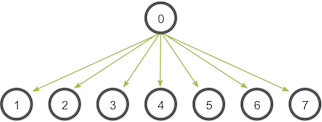

<h1 align="center"> ITF23019 - Parallel and Distributed Programming </h1>
<h3 align="center"> Spring 2021 </h2>
<h3 align="center"> Lab 11: MPI </h2>


In this lab, we will learn how to develop simple distributed application with FastMPJ.

## Submission Deadline

You need to commit your codes and lab report to your GitHub repository **before 10:00 AM Wednesday 21st April**.

## Introduction

> MPI (Message-Passing Interface) is a message-passing library interface specification. All parts of this definition are significant. MPI addresses primarily the message-passing parallel programming model, in which data is moved from the address space of one process to that of another process through cooperative operations on each process. Extensions to the “classical” message-passing model are provided in collective operations, remote-memory access operations, dynamic process creation, and parallel I/O. MPI is a specification, not an implementation; there are multiple implementations of MPI. This specification is for a library interface; MPI is not a language, and all MPI operations are expressed as functions, subroutines, or methods, according to the appropriate language bindings which, for C and Fortran, are part of the MPI standard. The standard has been defined through an open process by a community of parallel computing vendors, computer scientists, and application developers. The next few sections provide an overview of the history of MPI’s development.

In this lab, we will use the FastMPJ (Fast Message Passing in Java) library to develop the MPI applications in Java. The library can be downloaded at http://gac.udc.es/~rreye/fastmpj/download.html. Please go through the  [Install Guide](http://gac.udc.es/~rober/fastmpj/doc/html/UsersGuide.html#_install_guide) section for the instruction to install the library on your computer.

Then, you can import the `mpi` project to your Java IDE. If you get any errors related to the library, you should fix the `systemPath` the library in your `pom.xml` file.

```xml
<dependency>
    <groupId>mpi</groupId>
    <artifactId>FastMPJ</artifactId>
    <version>1.0</version>
    <scope>system</scope>
    <systemPath>C:\Program Files\FastMPJ\lib\mpj.jar</systemPath>
</dependency>
```

## MPI Hello World

Below are the code of the `HelloWorld.java` program:

```java
public static void main(String args[]) throws Exception
{
    int me,size;

    args = MPI.Init(args);
    me = MPI.COMM_WORLD.Rank();
    size = MPI.COMM_WORLD.Size();

    System.out.println(MPI.Get_processor_name() + ": Hello World from "+ me + " of " + size);

    MPI.Finalize();
}
```

 The MPI environment must be initialized with `MPI.Init`:

```java
public static String[] Init(java.lang.String[] argv) throws MPIException
```

During `MPI.Init`, all of MPI’s global and internal variables are constructed. For example, a communicator is formed around all of the processes that were spawned, and unique ranks are assigned to each process. 

After `MPI.Init`, there are two main functions that are called: `MPI.COMM_WORLD.Rank()` and `MPI.COMM_WORLD.Size()`. These two functions are used in almost every single MPI program that you will write.

```java
public int Rank() throws MPIException
public int Size() throws MPIException
```

`MPI.COMM_WORLD.Rank()`returns the rank of a process in a communicator. Each process inside of a communicator is assigned an incremental rank starting from zero. The ranks of the processes are primarily used for identification purposes when sending and receiving messages.

`MPI.COMM_WORLD.Size()`returns the size of a communicator. In our example, `MPI.COMM_WORLD`(which is constructed for us by MPI) encloses all of the processes in the job, so this call should return the amount of processes that were requested for the job.

A miscellaneous and less-used function in this program is `MPI.Get_processor_name()`:

```java
public static String Get_processor_name() throws MPIException
```

`MPI.Get_processor_name()` obtains the actual name of the processor on which the process is executing. The final call in this program is `MPI.Finalize()`:

```java
public static void Finalize() throws MPIException
```

`MPI.Finalize()` is used to clean up the MPI environment. No more MPI calls can be made after this one.

To compile the program, you should open a terminal (cmd) and change the working directory to the directory that contains the source files. Otherwise, if you use Eclipse, right click on the default package, then **Show in Local Terminal** -> **Terminal**.


Once you on the terminal, compile the program with `fmpjc` command, and run the program with `fmpjrun`:

```bash
fmpjc HelloWorld.java
fmpjrun -np 2 -class HelloWorld
```

The example above runs the program with 2 processes in localhost.


## Exercise 1 (20 points)

Compile and run the `HelloWorld.java` program with 4 processes. Include the screenshot of your output to your report.

## MPI Send and Receive

Sending and receiving are the two foundational concepts of MPI. Almost every single function in MPI can be implemented with basic send and receive calls. In this section, we will discuss how to use MPI’s blocking sending and receiving functions.

MPI’s send and receive calls operate in the following manner. First, process *A* decides a message needs to be sent to process *B*. Process A then packs up all of its necessary data into a buffer for process B. These buffers are often referred to as *envelopes* since the data is being packed into a single message before transmission (similar to how letters are packed into envelopes before transmission to the post office). After the data is packed into a buffer, the communication device (which is often a network) is responsible for routing the message to the proper location. The location of the message is defined by the process’s rank.

Even though the message is routed to B, process B still has to acknowledge that it wants to receive A’s data. Once it does this, the data has been transmitted. Process A is acknowledged that the data has been transmitted and may go back to work.

Sometimes there are cases when A might have to send many different types of messages to B. Instead of B having to go through extra measures to differentiate all these messages, MPI allows senders and receivers to also specify message IDs with the message (known as *tags*). When process B only requests a message with a certain tag number, messages with different tags will be buffered by the network until B is ready for them.

With these concepts in mind, let’s look at the prototypes for the MPI sending and receiving functions.

```java
public void Send(java.lang.Object buf,
                 int offset,
                 int count,
                 Datatype datatype,
                 int dest,
                 int tag)
          throws MPIException
    
public Status Recv(java.lang.Object buf,
                       int offset,
                       int count,
                       Datatype datatype,
                       int source,
                       int tag)
    		throws MPIException
```

The first argument is the data buffer, which must be one-dimensional array. The second and third arguments describe the count and type of elements that reside in the buffer. `MPI Send` sends the exact count of elements, and `MPI Recv` will receive **at most** the count of elements (more on this in the next lesson). The fourth and fifth arguments specify the rank of the sending/receiving process and the tag of the message. The return value of `MPI Recv` provides information about the received message.

## Exercise 2 (20 points)

The `Echo.java` demonstrates how to use `MPI Send` and `MPI Recv` to send data from one process to another process.

Compile and run the program with 2 processes. Include the screenshot of your output to your report.

## Collective Communication

We have examined point-to-point communication, which is communication between two processes. The next one is *collective communication*. Collective communication is a method of communication which involves participation of **all** processes in a communicator.

### Collective communication and synchronization points

One of the things to remember about collective communication is that it implies a *synchronization point* among processes. This means that all processes must reach a point in their code before they can all begin executing again.

Before going into detail about collective communication routines, let’s examine synchronization in more detail. As it turns out, MPI has a special function (`MPI.COMM_WORLD.Barrier()`) that is dedicated to synchronizing processes:

```java
public void Barrier() throws MPIException
```

The name of the function is quite descriptive - the function forms a barrier, and no processes in the communicator can pass the barrier until all of them call the function. 

`MPI Barrier` can be useful for many things. One of the primary uses of `MPI Barrier` is to synchronize a program so that portions of the parallel code can be timed accurately.

One final note about synchronization - Always remember that every collective call you make is synchronized. In other words, if you can’t successfully complete an `MPI Barrier`, then you also can’t successfully complete any collective call. If you try to call `MPI Barrier` or other collective routines without ensuring all processes in the communicator will also call it, your program will idle

### Broadcasting with MPI Broadcast

A *broadcast* is one of the standard collective communication techniques. During a broadcast, one process sends the same data to all processes in a communicator. One of the main uses of broadcasting is to send out user input to a parallel program, or send out configuration parameters to all processes.

The communication pattern of a broadcast looks like this:



In this example, process zero is the *root* process, and it has the initial copy of data. All of the other processes receive the copy of data.

In MPI, broadcasting can be accomplished by using `MPI.COMM_WORLD.Bcast`. The function prototype looks like this:

```java
public abstract void Bcast(java.lang.Object buf,
                           int offset,
                           int count,
                           Datatype datatype,
                           int root)
                    throws MPIException
```

Although the root process and receiver processes do different jobs, they all call the same `MPI Bcast` function. When the root process (in our example, it was process zero) calls `MPI Bcast`, the `buf` variable will be sent to all other processes. When all of the receiver processes call `MPI Bcast`, the `buf` variable will be filled in with the data from the root process.

### MPI Scatter

`MPI Scatter` is a collective routine that is very similar to `MPI Bcast` . `MPI Scatter` involves a designated root process sending data to all processes in a communicator. The primary difference between `MPI Bcast` and `MPI Scatter` is small but important. `MPI Bcast` sends the *same* piece of data to all processes while `MPI Scatter` sends *chunks of an array* to different processes. Check out the illustration below for further clarification.


In the illustration, `MPI Bcast` takes a single data element at the root process (the red box) and copies it to all other processes. `MPI Scatter` takes an array of elements and distributes the elements in the order of process rank. The first element (in red) goes to process zero, the second element (in green) goes to process one, and so on. Although the root process (process zero) contains the entire array of data, `MPI Scatter` will copy the appropriate element into the receiving buffer of the process. Here is what the function prototype of `MPI.COMM_WORLD.Scatter` looks like.

```java
public void Scatter(java.lang.Object sendbuf,
                             int sendoffset,
                             int sendcount,
                             Datatype sendtype,
                             java.lang.Object recvbuf,
                             int recvoffset,
                             int recvcount,
                             Datatype recvtype,
                             int root)
                      throws MPIException
```

The first parameter, `sendbuf`, is an array of data that resides on the root process. The second, third and fourth parameters, `sendoffset`,`sendcount` and `sendtype`, dictate where and how many elements of a specific MPI Datatype will be sent to each process. If `sendcount` is one and `sendtype` is `MPI_INT`, then process zero gets the first integer of the array, process one gets the second integer, and so on. If `sendcount` is two, then process zero gets the first and second integers, process one gets the third and fourth, and so on. In practice, `sendcount` is often equal to the number of elements in the array divided by the number of processes. 

The receiving parameters of the function prototype are nearly identical in respect to the sending parameters. The `recvbuf` parameter is a buffer of data that can hold `recvcount` elements that have a datatype of `recvtype`. The last parameter, `root`,  indicates the root process that is scattering the array of data.

If the number of elements isn’t divisible by the number of processes, then `MPI.COMM_WORLD.Scatterv` should be the one to be used:

```java
public void Scatterv(java.lang.Object sendbuf,
                              int sendoffset,
                              int[] sendcount,
                              int[] displs,
                              Datatype sendtype,
                              java.lang.Object recvbuf,
                              int recvoffset,
                              int recvcount,
                              Datatype recvtype,
                              int root)
                       throws MPIException
```

`MPI Scatterv` extends the functionality of `MPI Scatter` by allowing a varying count of data to be sent to each process, since `sendcount` is now an array. It also allows more flexibility as to where the data is taken from on the root, by providing the new argument, `displs`.

### MPI Gather

`MPI Gather` is the inverse of `MPI Scatter`. Instead of spreading elements from one process to many processes, `MPI Gather` takes elements from many processes and gathers them to one single process. This routine is highly useful to many parallel algorithms, such as parallel sorting and searching. Below is a simple illustration of this algorithm.


Similar to `MPI Scatter`, `MPI Gather` takes elements from each process and gathers them to the root process. The elements are ordered by the rank of the process from which they were received. The function prototype for `MPI.COMM_WORLD.Gather` is identical to that of `MPI.COMM_WORLD.Scatter`.

```java
public void Gather(java.lang.Object sendbuf,
                            int sendoffset,
                            int sendcount,
                            Datatype sendtype,
                            java.lang.Object recvbuf,
                            int recvoffset,
                            int recvcount,
                            Datatype recvtype,
                            int root)
                     throws MPIException
```

In `MPI Gather`, only the root process needs to have a valid receive buffer. All other calling processes can pass `NULL` for `recvbuf`. Also, don’t forget that the `recvcount` parameter is the count of elements received *per process*, not the total summation of counts from all processes.

Similarly, we have another version of `MPI Gather` which is `MPI Gatherv` to be used when the numbers of elements received from each process are different.

```java
public void Gatherv(java.lang.Object sendbuf,
                             int sendoffset,
                             int sendcount,
                             Datatype sendtype,
                             java.lang.Object recvbuf,
                             int recvoffset,
                             int[] recvcount,
                             int[] displs,
                             Datatype recvtype,
                             int root)
                      throws MPIException
```

## Exercise 3 (60 points)

The program `MatrixMatrixMult.java` computes the multiplication of two square matrices (NxN) with MPI.

Your tasks for this exercise are:

* Analyze the code and discuss shortly how the algorithm is implemented.
* Compile and run the program with 1, 2, 3, 4, ... processes, compute and discuss the speedup values.

## What To Submit

Complete the the exercises in this lab and put your code along with **lab11_report** (Markdown, TXT or PDF file) into the **lab11** directory of your repository. Commit and push your changes and remember to check the GitHub website to make sure all files have been submitted. 

## References

1. MPI 3.1 Specification. https://www.mpi-forum.org/docs/mpi-3.1/mpi31-report.pdf
2. FastMPJ. http://gac.udc.es/~rreye/fastmpj/
3. MPI Tutorial. https://mpitutorial.com/
