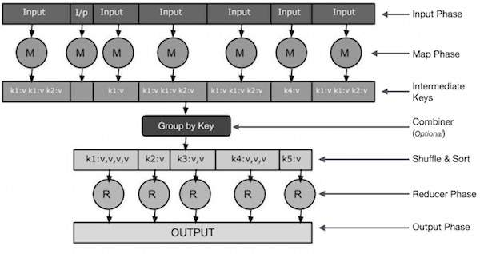
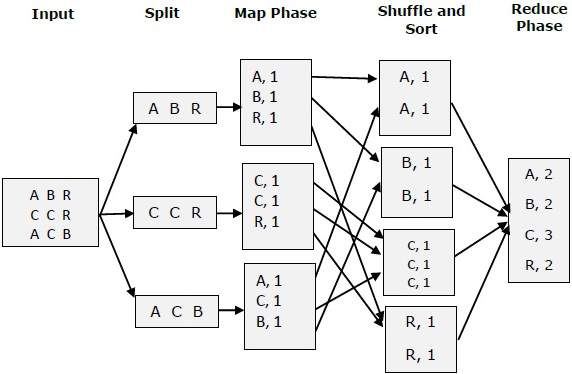

<h1 align="center"> ITF23019 - Parallel and Distributed Programming </h1>
<h3 align="center"> Spring 2021 </h2>
<h3 align="center"> Lab 12: MapReduce </h2>


This lab is an introduction to MapReduce programming paradigm. We will learn to use Spark framework to develop a simple word-count program based on MapReduce model.

## Submission Deadline

You need to commit your codes and lab report to your GitHub repository **before 10:00 AM Wednesday 28th April**.

## What is MapReduce

MapReduce is a processing technique and a program model for distributed computing based on java. The MapReduce algorithm contains two important tasks, namely Map and Reduce. Map takes a set of data and converts it into another set of data, where individual elements are broken down into tuples (key/value pairs). Secondly, reduce task, which takes the output from a map as an input and combines those data tuples into a smaller set of tuples. As the sequence of the name MapReduce implies, the reduce task is always performed after the map job.

The major advantage of MapReduce is that it is easy to scale data processing over multiple computing nodes. Under the MapReduce model, the data processing primitives are called mappers and reducers. Decomposing a data processing application into *mappers* and *reducers* is sometimes nontrivial. But, once we write an application in the MapReduce form, scaling the application to run over hundreds, thousands, or even tens of thousands of machines in a cluster is merely a configuration change. This simple scalability is what has attracted many programmers to use the MapReduce model.

### How MapReduce Works

The MapReduce algorithm contains two important tasks, namely Map and Reduce.

- The Map task takes a set of data and converts it into another set of data, where individual elements are broken down into tuples (key-value pairs).
- The Reduce task takes the output from the Map as an input and combines those data tuples (key-value pairs) into a smaller set of tuples.



- **Input Phase** − Here we have a Record Reader that translates each record in an input file and sends the parsed data to the mapper in the form of key-value pairs.
- **Map** − Map is a user-defined function, which takes a series of key-value pairs and processes each one of them to generate zero or more key-value pairs.
- **Intermediate Keys** − They key-value pairs generated by the mapper are known as intermediate keys.
- **Combiner** − A combiner is a type of local Reducer that groups similar data from the map phase into identifiable sets. It takes the intermediate keys from the mapper as input and applies a user-defined code to aggregate the values in a small scope of one mapper. It is not a part of the main MapReduce algorithm; it is optional.
- **Shuffle and Sort** − The Reducer task starts with the Shuffle and Sort step. It downloads the grouped key-value pairs onto the local machine, where the Reducer is running. The individual key-value pairs are sorted by key into a larger data list. The data list groups the equivalent keys together so that their values can be iterated easily in the Reducer task.
- **Reducer** − The Reducer takes the grouped key-value paired data as input and runs a Reducer function on each one of them. Here, the data can be aggregated, filtered, and combined in a number of ways, and it requires a wide range of processing. Once the execution is over, it gives zero or more key-value pairs to the final step.
- **Output Phase** − In the output phase, we have an output formatter that translates the final key-value pairs from the Reducer function and writes them onto a file using a record writer.

Let us try to understand the two tasks Map &f Reduce with the help of a small diagram



## Exercise (100 points):

In this exercise, we will implement a simple word-count (illustrated above) with Spark framework. The input is store in a `text.txt` file. You are free to use bigger dataset to test the performance of the program.

```java
JavaRDD<String> lines = ctx.textFile(inputFile);

JavaRDD<String> words = lines.flatMap(s -> Arrays.asList(SPACE.split(s)).iterator());

JavaPairRDD<String, Integer> ones = words.mapToPair(s -> new Tuple2<>(s, 1));

JavaPairRDD<String, Integer> counts = ones.reduceByKey((i1, i2) -> i1 + i2);

output = counts.collect();
```

Your task for this exercise, is to compute the speedup for the program. Remember to include a screenshot of the output to your lab report.

## What To Submit

Complete the the exercises in this lab and put your code along with **lab12_report** (Markdown, TXT or PDF file) into the **lab12** directory of your repository. Commit and push your changes and remember to check the GitHub website to make sure all files have been submitted. 

## References

1. Hadoop - MapReduce. https://www.tutorialspoint.com/hadoop/hadoop_mapreduce.htm

2. MapReduce - Introduction. https://www.tutorialspoint.com/map_reduce/map_reduce_introduction.htm

   

