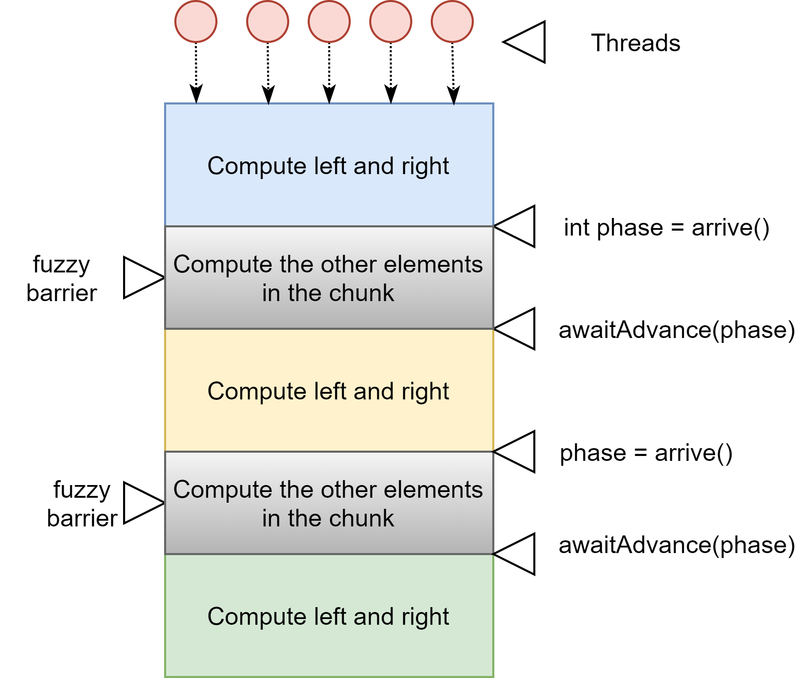

<h1 align="center"> ITF23019 - Parallel and Distributed Programming </h1>
<h3 align="center"> Spring 2021 </h2>
<h3 align="center"> Lab 5: Thread Synchronization 2 </h2>


In this lab, we will continue to evaluate two more thread synchronization utilities : `CompletableFuture` and `Phaser`

## Submission Deadline:

You need to commit your codes and lab report to your GitHub repository **before 10:00 AM Wednesday 24th February**.

## GitHub

If you have not config your `labs-yourusername` repository for upstream remote repository, please go back to the instruction from `lab2`.

Remember to commit and push your changes before starting this lab. Then, start the **Command Prompt** of GitHub Desktop and run the command:

```bash
> git pull upstream main
```

Then, **push** everything to your `labs-yourusername`.

## `CompletableFuture` 

This is a synchronization mechanism introduced in the Java 8 concurrency API that has new methods in Java 9. It allows you to implement an event-driven model, **linking tasks that will only be executed when others have finished**.

This class implements the `Future` object and the `CompletionStage` interface that gives it the following two characteristics:

* As the `Future` object, a `CompletableFuture` object will return a result sometime in future.
* As the `CompletionStage` object, you can execute more asynchronous tasks after the completion of one or more `CompletableFuture` objects.

Most of the methods explained below have the **Async** suffix. This means that these methods will be executed in a concurrent way using the
`ForkJoinPool.commonPool` instance. Those methods that have versions without the **Async** suffix will be executed in a serial way (that is to say, in the same thread where `CompletableFuture` is executed).

You can work with a `CompletableFuture` class in different ways: 

* You can create a `CompletableFuture` object explicitly and use it as a synchronization point between tasks. One task will establish the value returned by `CompletableFuture`, using the `complete()` method, and the other tasks will wait for this value, using the `get()` or `join()` methods. 

  ```java
  CompletableFuture<String> completableFuture = CompletableFuture.completedFuture("Hello");
  String result = completableFuture.get();
  ```

* You can use a static method of the `CompletableFuture` class to execute `Runnable` or `Supplier` with the `runAsync()` and `supplyAsync()` methods. These methods will return a `CompletableFuture` object that will be completed when these tasks end their execution.

  ```java
  class HelloRunnable implements Runnable {
      @Override
      public void run() {
          System.out.println("Hello");
      }
  }
  
  HelloRunnable helloRunnable = new HelloRunnable();
  CompletableFuture<Void> completableFuture = CompletableFuture.runAsync(helloRunnable);
  completableFuture.join();
  ```

   In the second case, the value returned by `Supplier` will be the completion value of `CompletableFuture`. 

  ```java
  class HelloSupplier implements Supplier<String> {
  			@Override
  			public String get() {
  				return "Hello";
  			}
  		}
  		
  HelloSupplier helloSupplier = new HelloSupplier();
  
  CompletableFuture<String> completableFuture = CompletableFuture.supplyAsync(helloSupplier);
  String result = completableFuture.get();
  ```

* You can specify other tasks to be executed in an asynchronous way after the completion of one or more `CompletableFuture` objects. This task can implement the `Runnable`, `Function`,  `BiFunction`, `Consumer` or `BiConsumer` interfaces.

  For example, here we use `CompletableFuture` to implement the below five tasks simultaneously. 

  

  ```java
  class HelloSupplier implements Supplier<String> {
      @Override
      public String get() {
          return "Hello";
      }
  }
  
  class UpperCaseFunction implements Function<String, String> {
  
      @Override
      public String apply(String t) {
          return t.toUpperCase();
      }
  
  }
  
  class LowerCaseFunction implements Function<String, String> {
  
      @Override
      public String apply(String t) {
          return t.toLowerCase();
      }
  
  }
  
  class PrintingConsumer implements Consumer<String>{
  
      @Override
      public void accept(String t) {
          System.out.println(t);
  
      }
  
  }
  
  HelloSupplier helloSupplier = new HelloSupplier();
  UpperCaseFunction upperCaseFunction = new UpperCaseFunction();
  LowerCaseFunction lowerCaseFunction = new LowerCaseFunction();
  PrintingConsumer printingConsumer = new PrintingConsumer();
  
  
  CompletableFuture<String> helloString = CompletableFuture.supplyAsync(helloSupplier);
  
  CompletableFuture<String> upperString =  helloString.thenApplyAsync(upperCaseFunction);
  CompletableFuture<Void> firstFuture = upperString.thenAcceptAsync(printingConsumer);
  
  CompletableFuture<String> lowerString =  helloString.thenApplyAsync(lowerCaseFunction);
  CompletableFuture<Void> secondFuture = lowerString.thenAcceptAsync(printingConsumer);
  
  CompletableFuture<Void> waitFuture = CompletableFuture.allOf(firstFuture, secondFuture);
  waitFuture.join();
  ```

This class provides a lot of methods that allow you to organize the order of execution of tasks implementing an event-driven model, where one task doesn't start its execution until the previous one has finished. These are some of those methods:

* `thenApplyAsync()`: This method receives an implementation of the `Function` interface that can be represented as a lambda expression as a parameter. This function will be executed when the calling `CompletableFuture` has been completed. This method will return `CompletableFuture` to get the result of the Function.
* `thenComposeAsync()`: This method is analogue to `thenApplyAsync`, but is useful when the supplied function returns `CompletableFuture` too.
* `thenAcceptAsync()`: This method is similar to the previous one, but the parameter is an implementation of the `Consumer` interface that can also be specified as a lambda expression; in this case, the computation won't return a result.
* `thenRunAsync()`: This method is equivalent to the previous one, but in this case receives a `Runnable` object as a parameter.
* `thenCombineAsync()`: This method receives two parameters. The first one is another `CompletableFuture` instance. The other is an implementation of the `BiFunction` interfaces that can be specified as a lambda function. This `BiFunction` will be executed when both `CompletableFuture` (the calling one and the parameter) have been completed. This method will return `CompletableFuture` to get the result of the `BiFunction`.
* `runAfterBothAsync()`: This method receives two parameters. The first one is another CompletableFuture. The other one is an implementation of the `Runnable` interface that will be executed when both `CompletableFuture` (the calling one and the parameter) have been completed.
* `runAfterEitherAsync()`: This method is equivalent to the previous one, but the `Runnable` task is executed when one of the `CompletableFuture` objects is completed.
* `allOf()`: This method receives a variable list of `CompletableFuture` objects as a parameter. It will return a `CompletableFuture<Void>` object that will return its result when all the `CompletableFuture` objects have been completed.
* `anyOf()`: This method is equivalent to the previous one, but the returned `CompletableFuture` returns its result when one of the `CompletableFuture` is completed.

Finally, if you want to obtain the result returned by `CompletableFuture`, you can use the `get()` or `join()` methods. Both methods block the calling thread until `CompletableFuture` has been completed and then returns its result. The main difference between both methods is that `get()` throws `ExecutionException`, which is a checked exception, but `join()` throws `RuntimeException` (which is an unchecked exception). Thus, it's easier to use `join()` inside non-throwing lambdas (like `Supplier`, `Consumer`, or `Runnable`).

The example in the project `completable` demonstrates the usage of `CompleteableFuture` to synchronize the following flow:


```java
System.out.printf("Main: Start\n");

SeedGenerator seedTask = new SeedGenerator();
CompletableFuture<Integer> seedFuture = CompletableFuture.supplyAsync(seedTask);

System.out.printf("Main: Getting the seed\n");
int seed = 0;
try {
    seed = seedFuture.get();
} catch (InterruptedException | ExecutionException e) {
    e.printStackTrace();
}
System.out.printf("Main: The seed is: %d\n", seed);

System.out.printf("Main: Launching the list of numbers generator\n");
NumberListGenerator task = new NumberListGenerator(seed);
CompletableFuture<List<Long>> startFuture = CompletableFuture.supplyAsync(task);

System.out.printf("Main: Launching step 1\n");


// Return the number that is closest to the pivot
CompletableFuture<Long> step1Future = startFuture.thenApplyAsync(list -> {
    System.out.printf("%s: Step 1: Start\n", Thread.currentThread().getName());
    long selected = 0;
    long selectedDistance = Long.MAX_VALUE;
    long distance;
    long pivot = 1000;
    for (Long number : list) {
        distance = Math.abs(number - pivot);
        if (distance < selectedDistance) {
            selected = number;
            selectedDistance = distance;
        }
    }
    System.out.printf("%s: Step 1: Result - %d\n", Thread.currentThread().getName(), selected);
    return selected;
});

// Return the maximum number in the list
System.out.printf("Main: Launching step 2\n");
CompletableFuture<Long> step2Future = startFuture
    .thenApplyAsync(list -> list.stream().max(Long::compare).get());


// Write the result of previous step2Future
CompletableFuture<Void> write2Future = step2Future.thenAccept(selected -> {
    System.out.printf("%s: Step 2: Result - %d\n", Thread.currentThread().getName(), selected);
});

System.out.printf("Main: Launching step 3\n");
NumberSelector numberSelector = new NumberSelector();
CompletableFuture<Long> step3Future = startFuture.thenApplyAsync(numberSelector);

System.out.printf("Main: Waiting for the end of the three steps\n");
CompletableFuture<Void> waitFuture = CompletableFuture.allOf(step1Future, write2Future, step3Future);
CompletableFuture<Void> finalFuture = waitFuture.thenAcceptAsync((param) -> {
    System.out.printf("Main: The CompletableFuture example has been completed.");
});

finalFuture.join();
```


## `Phaser`

The `Phaser` class is a synchronization mechanism designed to control the execution of algorithms that can be divided into phases in a concurrent way. If
you have a process with clearly defined steps, so you have to finish the first one before you can start the second one, and so on, you can use this class to make a concurrent version of your process. The `Phaser` class provides us with a mechanism to synchronize threads at the end of each step, so no thread will start with the second step until all the threads have finished the first one.

The main characteristics of the `Phaser` class are:

* The phaser must know the number of tasks it has to control. Java refers to this as the registration of the participants. A participant can register in a
  phaser any time.
* The tasks must inform the phaser when they finish a phase. The phaser will make that task sleep until all the participants have finished that phase.
* A participant can leave the control of the phaser any time. Java refers to this as deregistering the participants. You can execute custom code when the phaser makes a phase change.

You can register a participant using different methods:

* When you create the `Phaser` object: The `Phaser` class provides four different constructors. Two of them are commonly used:
  * `phaser()`: This constructor creates a phaser with zero participants.
  * `phaser(int parties)`: This constructor creates a phaser with the given number of participants.
* Explicitly, using one of these methods:
  * `bulkRegister(int parties)`: Register the given number of new participants at the same time
  * `register()`: Register one new participant.

The main purpose of the phaser is to allow the implementation of algorithms that are clearly divided into phases in a concurrent way. None of the tasks can advance to the next phase until all the tasks have finished the previous phase. The `Phaser` class provides three methods to signal that the task has finished the phase: `arrive()`, `arriveAndDeregister()`, and `arriveAndAwaitAdvance()`. If one of the tasks doesn't call one of these methods, the rest of the participant tasks will be blocked by the phaser indefinitely. To advance to the next phase, the following methods are used:

* `arriveAndAwaitAdvance()`: A task uses this method to indicate to the phaser that it has finished the current phase and wants to continue with the next one. The phaser will block the tasks until all the participant tasks have called one of the synchronization methods.
* `awaitAdvance(int phase)`: A task uses this method to indicate to the phaser that it wants to wait for the finalization of the current `phase` if the number we pass as a parameter and the actual `phase` of the phaser are equal. If they aren't equal, this method returns immediately.

The `arriveAndAwaitAdvance()` is used for "strict barrier" while `arrive()` and `awaitAdvance(int phase)` are used for "fuzzy barrier":

|                      Strict Barrier                      |                      Fuzzy Barrier                      |
| :------------------------------------------------------: | :-----------------------------------------------------: |
|  |  |

The `Phaser` class provides a method that is executed each time phaser changes the phase. It's the `onAdvance()` method. It receives two parameters: the number of the current phases and the number of registered participants. It returns a `Boolean` value `false` if `Phaser` continues its execution or the value `true` if `Phaser` has finished and has to enter the termination state.

The default implementation of this method returns `true` if the number of registered participants is zero, and `false` otherwise. But you can modify this behavior if you extend the `Phaser` class and override this method. Normally, you will be interested in doing this when you have to execute some actions when you advance from one phase to the next.


The project  `phaser` simulates the flow illustrated in the figure below. Specially, the program creates 5 `Student` threads and synchronize them with "strict barrier". The `MyPhaser` class is an extension of the `Phaser` class, which prints out respective messages whenever the phaser advances new phase.


```java
/**
	 * Main method of the student. It arrives to the exam and does three exercises. After each
	 * exercise, it calls the phaser to wait that all the students finishes the same exercise
	 */
public void run() {
    System.out.printf("%s: Has arrived to do the exam. %s\n",Thread.currentThread().getName(),new Date());
    phaser.arriveAndAwaitAdvance();
    System.out.printf("%s: Is going to do the first exercise. %s\n",Thread.currentThread().getName(),new Date());
    doExercise();
    System.out.printf("%s: Has done the first exercise. %s\n",Thread.currentThread().getName(),new Date());
    phaser.arriveAndAwaitAdvance();
    System.out.printf("%s: Is going to do the second exercise. %s\n",Thread.currentThread().getName(),new Date());
    doExercise();
    System.out.printf("%s: Has finished the exam. %s\n",Thread.currentThread().getName(),new Date());
    phaser.arriveAndAwaitAdvance();
}
```

The project `fuzzy_phaser` does the similar simulation with "fuzzy barrier". The figure below illustrate the execution flow of the threads.


```java
/**
	 * Main method of the student. It arrives to the exam and does exercises. After each
	 * exercise, it calls the phaser to wait that all the students finishes the same exercise
	 */
public void run() {
    System.out.printf("%s: Has arrived to do the class. %s\n",Thread.currentThread().getName(),new Date());
    int phase = phaser.arrive(); //ready to do the exercise

    System.out.printf("%s: Is doing something else while waiting for other to arrive the class. %s\n",Thread.currentThread().getName(),new Date());
    doSomething();

    phaser.awaitAdvance(phase); //Nothing else to do, but still need to wait for others

    System.out.printf("%s: Is doing the exam. %s\n",Thread.currentThread().getName(),new Date());
    doExercise();

    phase = phaser.arrive(); //Finish the exercise, waiting for other to finish

    System.out.printf("%s: Has finished the exam. Doing something else while waiting for other to finish %s\n",Thread.currentThread().getName(),new Date());
    
    doSomething();

    phaser.awaitAdvance(phase);  //Nothing else to do, but still need to wait for others
}
```

## Exercise 1 (40 points):

 in the project `completable`, you can see that the `CompletetableMain` class used lambda expression for the implementation of function and consumer. In this exercise, you are asked to rewrite those lambda expression to classes that implement respective interfaces. Specifically, you need to rewrite the `step1Future` by using`ClosestDistanceSelector` and `write2Future` by using `NumberPrinter` . Follow the instruction in the corresponding classes. Remember to include screenshot of your program output to the report.

## Exercise 2 (60 points):

In this exercise, we will examine the **Iterative Averaging** problem. Iterative Averaging is the process of updating an array so that each index becomes the average of the indices one before and one after it. After repeating this for many iterations, the array may converge to one set of numbers. For example, when given the following array, we can perform iterations of this algorithm until the array eventually converges:


To implement this problem, we use two arrays, one keeps the value of previous phase (iteration), the other contains the values for this current phase (iteration). After each phase, we need to swap the array and continue the next iteration:

```java
    /**
     * Sequential implementation of one-dimensional iterative averaging.
     *
     * @param iterations The number of iterations to run
     * @param myNew A double array that starts as the output array
     * @param myVal A double array that contains the initial input to the
     *        iterative averaging problem
     * @param n The size of this problem
     */
    public static void runSequential(final int iterations, final double[] myNew,
            final double[] myVal, final int n) {
        double[] next = myNew;
        double[] curr = myVal;

        for (int iter = 0; iter < iterations; iter++) {
            for (int j = 1; j <= n; j++) {
                next[j] = (curr[j - 1] + curr[j + 1]) / 2.0;
            }
            //Swap the buffer
            double[] tmp = curr;
            curr = next;
            next = tmp;
        }
    }
```

As you can see, this problem can be parallelized by splitting the array into smaller arrays and assigning them for multiple threads. At the end of each iteration, one threads need to wait for the other to finish current iteration in order to proceed to the next iteration. We can use "strict barrier" with `Phaser` to implement this parallel version:


In this version, for each thread, firstly, it has to compute the chunk which is the sub-array to be computed. This chunk is specified by two integer `lelf` and `right`. Then, each thread will start its local computation. Once they finish the computation of one phase, it has to wait for the other threads finish in order to proceed to next phase.

```java
for (int iter = 0; iter < iterations; iter++) {
    for (int j = left; j <= right; j++) {
        threadPrivateMyNew[j] = (threadPrivateMyVal[j - 1] + threadPrivateMyVal[j + 1]) / 2.0;
    }
    ph.arriveAndAwaitAdvance();

    double[] temp = threadPrivateMyNew;
    threadPrivateMyNew = threadPrivateMyVal;
    threadPrivateMyVal = temp;
}
```

You should notice that in order to compute the values of one chunk in the next phase, the threads does not need to wait for the other chunks to complete previous phase. Instead, only the values at the border (left and right) of the other chunks are required. For example, in order for thread 2, that is responsible for computing chunk 2, to procced to the next phase, it needs only the the `right` value of chunk 1 and the `left ` value of chunk 3 at the current phase:


So, instead of making thread 2 wait for all of the threads, it just need to wait for those two values in order to proceed to next phase. We can implement this with "fuzzy barrier". Accordingly, each thread needs to compute its `left` and `right` value first, then indicates the phaser that those values are ready with `arrive()`. After that, it can continues with the rest of the elements in the chunk. Finally, when all the elements of chunk are computed, it wait to proceed to next phase.



```java
for (int iter = 0; iter < iterations; iter++) {

    threadPrivateMyNew[left] = (threadPrivateMyVal[left - 1] + threadPrivateMyVal[left + 1]) / 2.0;

    threadPrivateMyNew[right] = (threadPrivateMyVal[right - 1] + threadPrivateMyVal[right + 1]) / 2.0;

    int currentPhase = ph.arrive();

    for (int j = left + 1; j <= right - 1; j++) { 
        threadPrivateMyNew[j] = (threadPrivateMyVal[j - 1] + threadPrivateMyVal[j + 1]) / 2.0;
    }

    ph.awaitAdvance(currentPhase);

    double[] temp = threadPrivateMyNew;
    threadPrivateMyNew = threadPrivateMyVal;
    threadPrivateMyVal = temp;
}
```

Your task for this exercise is finishing the implementation of the two parallel versions in project `one-dimension-averaging`. Also compute speedup for the two implementations. 

Remember to include the screenshot of the output to the report.

## Bonus Exercise (20 points)

In this exercise, we will examine the usage of multiple phasers in the implementation of pipeline problem. In this problem, we need to process a series of items which has multiple stages. The output of one stage is the input of the next stage. 

The figure below illustrate an example of pipeline in which each item has 3 stages. Here we have 4 items, if we process them sequentially, it will take `4*3 = 12` units of time to finish. However, with pipeline, each stage will be processed by one thread. Therefore, the total execution time is only 6 units of time.

In general, if we have `n` items each of them has `p` stages, the execution time will be `n + p - 1`.


The sequential version of this simulation of pipeline is:

```java
for(int i = 0; i < n; i++) { //For n items
    doWork(10); // Work on the stage A
    doWork(10); // Work on the stage B
    doWork(10); // Work on the stage C
}
```

To implement the pipeline, we create 3 threads that are responsible for 3 stages. Also, we need to use 2 phasers that manage the synchronization of the first two stages.

For the first stage:

```java
for(int i = 0; i < n; i ++) {
					doWork(10);		 // Work on the stage A	
    				phaserA.arrive() // Indicate that stage A completed
				}
```

For the second stage:

```java
for(int i = 0; i < n; i ++) {
					phaserA.awaitAdvance() // Waiting for Stage A to complete
					doWork(10);			   // Work on the stage B
    				phaserB.arrive() 	   // Indicate that stage B completed
				}
```

For the third stage:

```java
for(int i = 0; i < n; i ++) {
					phaserB.awaitAdvance() // Waiting for Stage B to complete
					doWork(10);			   // Work on the stage C
				}
```

Your task in this exercise is to complete the implementation of the `pipeline` project and compute the speedup.

Remember to include the screenshot of the output to the report.

## What To Submit

Complete the the exercises in this lab and put your code along with **lab5_report** (Markdown, TXT or PDF file) into the **lab5** directory of your repository. Commit and push your changes and remember to check the GitHub website to make sure all files have been submitted. 

## References:

1. González, Javier Fernández. *Mastering Concurrency Programming with Java 9*. Packt Publishing Ltd, 2017.
2. González, Javier Fernández. *Java 9 Concurrency Cookbook*. Packt Publishing Ltd, 2017.