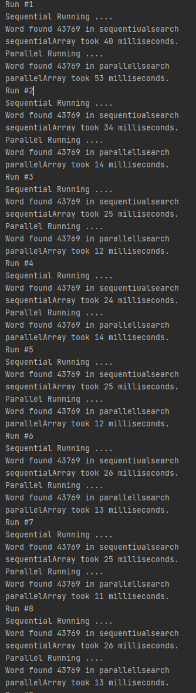
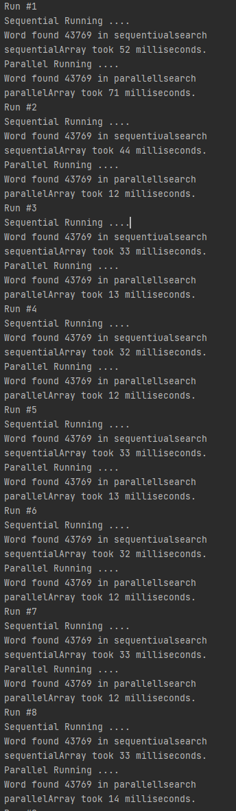

<h1 align="center"> ITF23019 - Parallel and Distributed Programming </h1>
<h3 align="center"> Spring 2021 - Project </h2>
<h3 align="center"> Word finder - serial vs parallel </h2>

###Input

This is a simple program that has a textfile that is beeing read by a scanner. 
This is not optimal for the speed, but it was a simple way to get a big array of words.
The Word is chosen at random from the generated text, the word is PAIN.
I use the function .toUpperCase() to make sure all the encounters of the word will be correct. 

###Overview 

The task class is extending RecursiveTask<Integer> to create parallelism. 
The compute method is pretty simple. It checks if the array is small enough to be worked on if not it will be split again.
If it is small enough it will check if the word is in the split array and count the occurrences. 

In the ParallelArraySearch taking in an array of strings and creates tasks, forjoinpool (with the option to select amount of processor cores)
and returns a pool.invoke() with task as the parameter. The invoke call is a simple submit, this means that the task is added to the pool.
This task will then be executed on a different thread. 

###2Cores

###4Cores

###6Cores
  

###8Cores
  

###10Cores
  

###Results 

2 cores - 1.433  
4 cores - 1.666  
6 cores - 1.809  
8 cores - 1.951  
10 cores - 1.493  

As we can see at this amount of words the sweetspot is 8 cores (16 threads). Once I try to use 10 cores the speedup
drops a lot. This might be because I only have 8 cores in my CPU and this could be causing some kind of block in the processing.
However, the speedup is pretty underwhelming. Considering 16 threads are not even reaching a 2x in speed. 
It could be several reasons why this speedup isn't that big 

